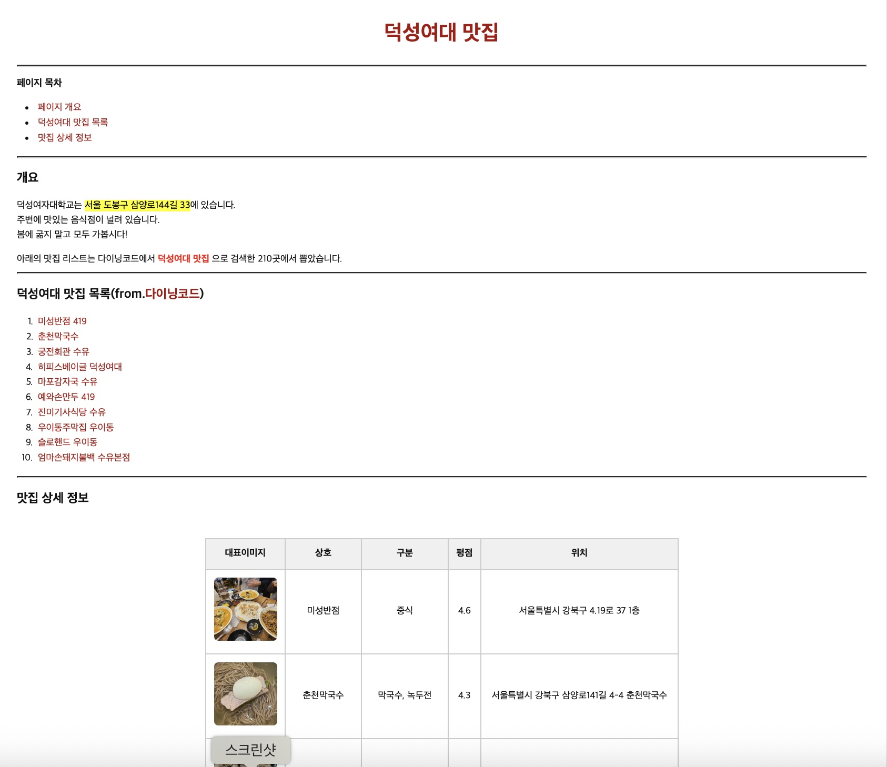

# 덕성여대 근처 맛집 소개

---

## 📌 개요

이 프로젝트는 HTML과 CSS만을 사용하여 구성된 정적 웹사이트입니다.  
덕성여대 주변 음식점을 소개하는 콘텐츠를 포함하며, 
각 음식점에 대한 **상세정보 페이지**, **대표 테이블**, **지도 정보**, **외부 링크**, **목차**, **앵커 이동** 등이 포함되어 있습니다.

---

## 📂 프로젝트 구성

- **index.html** : 맛집 소개 메인 페이지
  - 페이지 개요
  - 다이닝코드 기반 맛집 리스트
  - 각 상점별 대표 이미지와 테이블
  - 상세 페이지로 연결되는 링크 포함
- **pages/place1.html ~ place10.html** : 음식점 별 상세 정보 페이지
  - 해당 음식점의 설명, 외부 링크, 상세 정보 테이블, 구글 지도 iframe 포함
- **style.css** : 모든 페이지에서 사용하는 외부 스타일시트

---

## ✅ 사용 기술 및 구성 요소

- `HTML5` + `CSS3`
- 시맨틱 태그 활용 (`<section>`, `<thead>`, `<tbody>` 등)
- 외부 스타일시트 분리 적용
- `<a>` 링크를 통한 내부/외부 연결
- `<iframe>`으로 구글 지도 삽입
- `<table>`과 ``를 조합한 대표 테이블
- 호버 효과 추가
- GitHub Pages 정적 배포

---

## 🔗 배포 링크

👉 [덕성여대 맛집 소개 웹사이트](https://yujinshim05.github.io/dswu_yumm/)

---

## 🧾 출처 및 참고

- 다이닝코드: [덕성여대 맛집 검색 결과](https://www.diningcode.com/list.dc?query=덕성여대)
- 네이버 플레이스 지도
- 구글 지도 iframe

---

## 🙋🏻‍♀️ 제작자

- 이름: 심유진
- 이메일: yujinshim05@gmail.com
- 깃허브: [github.com/yujinshim05](https://github.com/yujinshim05)

